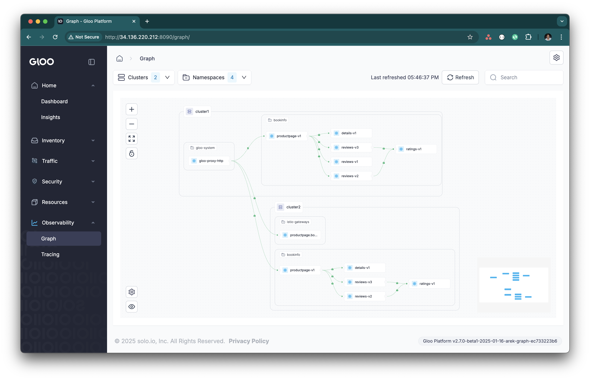

# Gloo Ambient Multi-Cluster Demo

## Create two clusters and set these env vars to their contexts
```bash
export CLUSTER1=gke_field-engineering-us_us-central1-c_rvennam-ilm
export CLUSTER2=gke_field-engineering-us_us-central1-c_rvennam-ilm-2
export ISTIOCTL=/Users/ramvennam/Downloads/istioctl
```


Set up credentials for images (private builds)
```bash
cd ~/Downloads # wherever your creds are
for context in ${CLUSTER1} ${CLUSTER2}; do
  for namespace in gloo-system istio-system kube-system istio-gateways bookinfo; do
    kubectl --context=${context} create namespace ${namespace} || true
    kubectl --context=${context} create secret docker-registry regcred \
      --docker-server=https://us-docker.pkg.dev \
      --docker-username=_json_key \
      --docker-password="$(cat secret.json)" \
      --docker-email=therealrameth@gmail.com \
      -n ${namespace}
  done
done
```

### Configure Trust
```bash
cd ~/istio-1.24.2
```bash
function create_cacerts_secret() {
  context=${1:?context}
  cluster=${2:?cluster}
  kubectl --context=${context} create secret generic cacerts -n istio-system \
    --from-file=certs/${cluster}/ca-cert.pem \
    --from-file=certs/${cluster}/ca-key.pem \
    --from-file=certs/${cluster}/root-cert.pem \
    --from-file=certs/${cluster}/cert-chain.pem
}

create_cacerts_secret ${CLUSTER1} cluster1
create_cacerts_secret ${CLUSTER2} cluster2
```

## Install Istio on both clusters using Gloo Operator
```bash
helm upgrade --install --kube-context=${CLUSTER1} gloo-operator oci://us-docker.pkg.dev/solo-public/gloo-operator-helm/gloo-operator --version 0.1.0-beta.2 -n gloo-system --create-namespace
helm upgrade --install --kube-context=${CLUSTER2} gloo-operator oci://us-docker.pkg.dev/solo-public/gloo-operator-helm/gloo-operator --version 0.1.0-beta.2 -n gloo-system --create-namespace
```


Use the `ServiceMeshController` resource to install Istio on both clusters

```bash
kubectl --context=${CLUSTER1} apply -f - <<EOF
apiVersion: operator.gloo.solo.io/v1
kind: ServiceMeshController
metadata:
  name: istio
spec:
  version: 1.24-alpha.36d8d1c094bdb946f793b4cf5e07167df5faaad8-internal
  installNamespace: istio-system
  cluster: cluster1
  network: cluster1
  repository:
    url: oci://us-docker.pkg.dev/istio-enterprise-private/internal-istio-helm
    secrets:
      - name: regcred
        namespace: gloo-system
  image:
    repository: docker.io/rvennam
    secrets:
      - name: regcred
EOF

kubectl --context=${CLUSTER2} apply -f - <<EOF
apiVersion: operator.gloo.solo.io/v1
kind: ServiceMeshController
metadata:
  name: istio
spec:
  version: 1.24-alpha.36d8d1c094bdb946f793b4cf5e07167df5faaad8-internal
  installNamespace: istio-system
  cluster: cluster2
  network: cluster2
  repository:
    url: oci://us-docker.pkg.dev/istio-enterprise-private/internal-istio-helm
    secrets:
      - name: regcred
        namespace: gloo-system
  image:
    repository: docker.io/rvennam
    secrets:
      - name: regcred
EOF
```


## Link the clusters together

Expose using an east-west gateway:
```bash
$ISTIOCTL --context=${CLUSTER1} multicluster expose --wait -n istio-gateways
$ISTIOCTL --context=${CLUSTER2} multicluster expose --wait -n istio-gateways
```
Link clusters together:
```bash
$ISTIOCTL multicluster link --contexts=$CLUSTER1,$CLUSTER2 -n istio-gateways
```
# Install Bookinfo sample on both clusters
Run the following commands to deploy the bookinfo application on the clusters:

```bash
for context in ${CLUSTER1} ${CLUSTER2}; do
  kubectl --context ${context} create ns bookinfo
  kubectl --context ${context} label namespace bookinfo istio.io/dataplane-mode=ambient
  kubectl --context ${context} apply -n bookinfo -f https://raw.githubusercontent.com/istio/istio/release-1.24/samples/bookinfo/platform/kube/bookinfo.yaml
done
```

Enable productpage to be multi-cluster on both clusters
```bash
for context in ${CLUSTER1} ${CLUSTER2}; do
  kubectl --context ${context}  -n bookinfo label service productpage solo.io/service-scope=global
  kubectl --context ${context}  -n bookinfo annotate service productpage  networking.istio.io/traffic-distribution=Any
done
```

# Expose Productpage using Istio Gateway

```yaml
apiVersion: gateway.networking.k8s.io/v1
kind: Gateway
metadata:
  name: bookinfo-gateway
  namespace: bookinfo
spec:
  gatewayClassName: istio
  listeners:
  - name: http
    port: 80
    protocol: HTTP
    allowedRoutes:
      namespaces:
        from: Same
---
apiVersion: gateway.networking.k8s.io/v1
kind: HTTPRoute
metadata:
  name: bookinfo
  namespace: bookinfo
spec:
  parentRefs:
  - name: bookinfo-gateway
  rules:
  - matches:
    - path:
        type: Exact
        value: /productpage
    - path:
        type: PathPrefix
        value: /static
    - path:
        type: Exact
        value: /login
    - path:
        type: Exact
        value: /logout
    - path:
        type: PathPrefix
        value: /api/v1/products
    # backendRefs:
    # - name: productpage
    #   port: 9080
    backendRefs:
    - kind: Hostname
      group: networking.istio.io
      name: productpage.bookinfo.mesh.internal
      port: 9080

```

```bash
curl $(kubectl get svc -n bookinfo bookinfo-gateway-istio --context $REMOTE_CONTEXT1 -o jsonpath="{.status.loadBalancer.ingress[0]['hostname','ip']}")/productpage
```
Voila!

## Gloo Mesh Core UI:

### cluster1 will be both workload and managment:
```bash

meshctl install --profiles gloo-core-single-cluster \
--kubecontext $CLUSTER1 \
--set common.cluster=cluster1 \
--set licensing.glooMeshCoreLicenseKey=$GLOO_MESH_CORE_LICENSE_KEY \
--set telemetryGateway.enabled=true
```

### Register cluster2 as a workload cluster to cluster1:
```bash
export TELEMETRY_GATEWAY_IP=$(kubectl get svc -n gloo-mesh gloo-telemetry-gateway --context $CLUSTER1 -o jsonpath="{.status.loadBalancer.ingress[0]['hostname','ip']}")
export TELEMETRY_GATEWAY_PORT=$(kubectl get svc -n gloo-mesh gloo-telemetry-gateway --context $CLUSTER1 -o jsonpath='{.spec.ports[?(@.name=="otlp")].port}')
export TELEMETRY_GATEWAY_ADDRESS=${TELEMETRY_GATEWAY_IP}:${TELEMETRY_GATEWAY_PORT}
echo $TELEMETRY_GATEWAY_ADDRESS

meshctl cluster register cluster2  --kubecontext $CLUSTER1 --profiles gloo-core-agent --remote-context $CLUSTER2 --telemetry-server-address $TELEMETRY_GATEWAY_ADDRESS
```
```
meshctl dashboard
```
