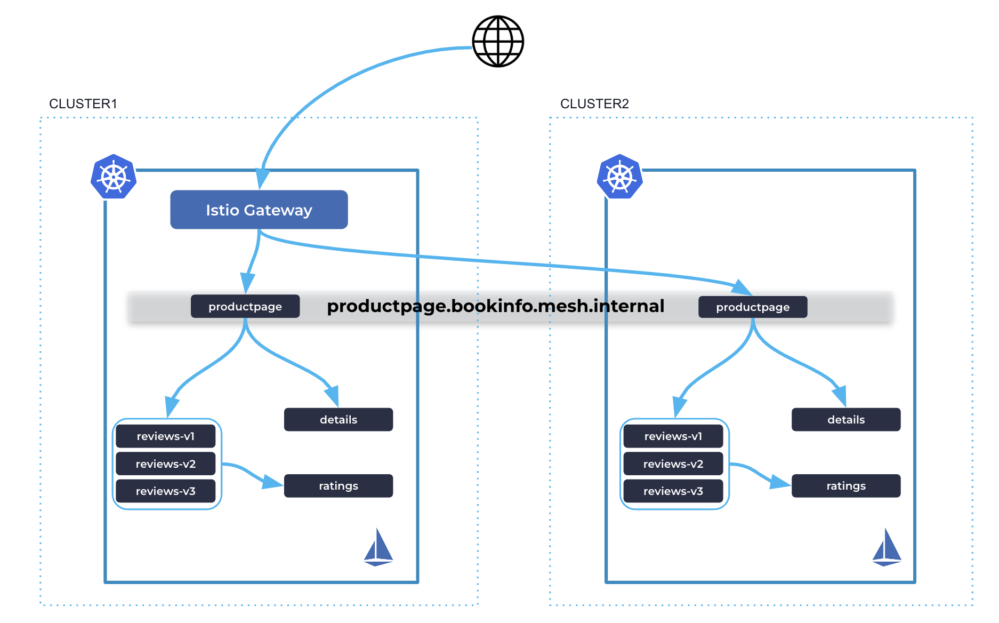

# Omni

Gloo: An omni-directional solution that covers ingress, service-to-service, and egress traffic with a unified approach.

##  Part 1: Gloo Ambient Multi-Cluster Mesh

In this part, we will set up Istio with Ambient mode across two clusters, deploy Bookinfo sample and expose multi-cluster productpage using Istio Gateway.



### Env

1. Create two clusters
2. Grab the latest istioctl nightly build

Set env vars
```bash
export CLUSTER1=gke_ambient_one
export CLUSTER2=gke_ambient_two
export ISTIOCTL=/Users/ramvennam/Downloads/istioctl
```

### Configure Trust

https://istio.io/latest/docs/tasks/security/cert-management/plugin-ca-cert/

```bash
function create_cacerts_secret() {
  context=${1:?context}
  cluster=${2:?cluster}
  kubectl --context=${context} create ns istio-system || true
  kubectl --context=${context} create ns istio-gateways || true
  kubectl --context=${context} create secret generic cacerts -n istio-system \
    --from-file=$HOME/istio-1.24.2/certs/${cluster}/ca-cert.pem \
    --from-file=$HOME/istio-1.24.2/certs/${cluster}/ca-key.pem \
    --from-file=$HOME/istio-1.24.2/certs/${cluster}/root-cert.pem \
    --from-file=$HOME/istio-1.24.2/certs/${cluster}/cert-chain.pem
}

create_cacerts_secret ${CLUSTER1} cluster1
create_cacerts_secret ${CLUSTER2} cluster2
```

### Install Istio on both clusters using Gloo Operator

Install the operator
```bash
helm upgrade --install --kube-context=${CLUSTER1} gloo-operator oci://us-docker.pkg.dev/solo-public/gloo-operator-helm/gloo-operator --version 0.1.0-beta.3 -n gloo-system --create-namespace
helm upgrade --install --kube-context=${CLUSTER2} gloo-operator oci://us-docker.pkg.dev/solo-public/gloo-operator-helm/gloo-operator --version 0.1.0-beta.3 -n gloo-system --create-namespace
```


Use the `ServiceMeshController` resource to install Istio on both clusters

```bash
kubectl --context=${CLUSTER1} apply -f - <<EOF
apiVersion: operator.gloo.solo.io/v1
kind: ServiceMeshController
metadata:
  name: istio
spec:
  version: 1.24-alpha.c5f994b3f8c5ab3b6d00ea7347c656667dd8568d-internal
  installNamespace: istio-system
  cluster: cluster1
  network: cluster1
  repository:
    url: oci://registry-1.docker.io/rvennam
  image:
    repository: docker.io/rvennam
EOF

kubectl --context=${CLUSTER2} apply -f - <<EOF
apiVersion: operator.gloo.solo.io/v1
kind: ServiceMeshController
metadata:
  name: istio
spec:
  version: 1.24-alpha.c5f994b3f8c5ab3b6d00ea7347c656667dd8568d-internal
  installNamespace: istio-system
  cluster: cluster2
  network: cluster2
  repository:
    url: oci://registry-1.docker.io/rvennam
  image:
    repository: docker.io/rvennam
EOF
```


### Link the clusters together

Expose using an east-west gateway:
```bash
$ISTIOCTL --context=${CLUSTER1} multicluster expose --wait -n istio-gateways
$ISTIOCTL --context=${CLUSTER2} multicluster expose --wait -n istio-gateways
```
Link clusters together:
```bash
$ISTIOCTL multicluster link --contexts=$CLUSTER1,$CLUSTER2 -n istio-gateways
```

### Install Bookinfo sample on both clusters
Run the following commands to deploy the bookinfo application on the clusters:

```bash
for context in ${CLUSTER1} ${CLUSTER2}; do
  kubectl --context ${context} create ns bookinfo 
  kubectl --context ${context} label namespace bookinfo istio.io/dataplane-mode=ambient
  kubectl --context ${context} apply -n bookinfo -f https://raw.githubusercontent.com/istio/istio/release-1.24/samples/bookinfo/platform/kube/bookinfo.yaml
  kubectl --context ${context} apply -n bookinfo -f https://raw.githubusercontent.com/istio/istio/release-1.24/samples/bookinfo/platform/kube/bookinfo-versions.yaml
done
```

Enable productpage to be multi-cluster on both clusters
```bash
for context in ${CLUSTER1} ${CLUSTER2}; do
  kubectl --context ${context}  -n bookinfo label service productpage solo.io/service-scope=global
  kubectl --context ${context}  -n bookinfo annotate service productpage  networking.istio.io/traffic-distribution=Any
done
```

### Expose Productpage using Istio Gateway

Apply the following Kubernetes Gateway API resources to cluster1 to expose productpage service using an Istio gateway:

```yaml
apiVersion: gateway.networking.k8s.io/v1
kind: Gateway
metadata:
  name: bookinfo-gateway
  namespace: bookinfo
spec:
  gatewayClassName: istio
  listeners:
  - name: http
    port: 80
    protocol: HTTP
    allowedRoutes:
      namespaces:
        from: Same
---
apiVersion: gateway.networking.k8s.io/v1
kind: HTTPRoute
metadata:
  name: bookinfo
  namespace: bookinfo
spec:
  parentRefs:
  - name: bookinfo-gateway
  rules:
  - matches:
    - path:
        type: Exact
        value: /productpage
    - path:
        type: PathPrefix
        value: /static
    - path:
        type: Exact
        value: /login
    - path:
        type: Exact
        value: /logout
    - path:
        type: PathPrefix
        value: /api/v1/products
    # backendRefs:
    # - name: productpage
    #   port: 9080
    backendRefs:
    - kind: Hostname
      group: networking.istio.io
      name: productpage.bookinfo.mesh.internal
      port: 9080

```

Wait until a LB IP gets assigned to bookinfo-gateway-istio svc and then visit the app!

```bash
curl $(kubectl get svc -n bookinfo bookinfo-gateway-istio --context $CLUSTER1 -o jsonpath="{.status.loadBalancer.ingress[0]['hostname','ip']}")/productpage
```
Voila! This should be round robinning between productpage on both clusters.


### L7 - Istio Waypoint
For L7 advanced traffic control, we need a waypoint. In this section, we will deploy a standard Isito waypoint, but in part 2, we will replace thsi waypoint with a Gloo Gateway as waypoint.

```bash
for context in ${CLUSTER1} ${CLUSTER2}; do
  istioctl --context=${context} waypoint apply -n bookinfo
  kubectl --context=${context} label ns bookinfo istio.io/use-waypoint=waypoint
  kubectl --context=${context} apply -f ./reviews-v1.yaml 
done
```

### Gloo Mesh Core UI:

### cluster1 will be both workload and managment:
```bash

meshctl install --profiles gloo-core-single-cluster \
--kubecontext $CLUSTER1 \
--set common.cluster=cluster1 \
--set licensing.glooMeshCoreLicenseKey=$GLOO_MESH_CORE_LICENSE_KEY \
--set telemetryGateway.enabled=true
```

### Register cluster2 as a workload cluster to cluster1:
```bash
export TELEMETRY_GATEWAY_ADDRESS=$(kubectl get svc -n gloo-mesh gloo-telemetry-gateway --context $CLUSTER1 -o jsonpath="{.status.loadBalancer.ingress[0]['hostname','ip']}"):4317
echo $TELEMETRY_GATEWAY_ADDRESS

meshctl cluster register cluster2  --kubecontext $CLUSTER1 --profiles gloo-core-agent --remote-context $CLUSTER2 --telemetry-server-address $TELEMETRY_GATEWAY_ADDRESS
```
```
meshctl dashboard
```


# Clean up

```bash
for context in ${CLUSTER1} ${CLUSTER2}; do
  kubectl --context=${context} scale deploy gloo-operator --replicas=1 -n gloo-system
  kubectl --context=${context} delete gateways --all -n istio-gateways
  kubectl --context=${context} delete ns bookinfo
  kubectl --context=${context} delete smc --all
  sleep 10
  helm uninstall gloo-operator -n gloo-system --kube-context=${context}
  sleep 5
  kubectl --context=${context} delete ns istio-system 
  kubectl --context=${context} delete ns gloo-system
  kubectl --context=${context} delete ns istio-gateways 
  meshctl uninstall --kubecontext=${context}
  kubectl --context=${context} delete ns gloo-mesh
done
```


## Use nightly UI images

```bash
k apply -f ./gloo-mesh-ui-gloo-mesh-cluster-role.yaml
k  set image Deployment/gloo-mesh-ui -n gloo-mesh console=us-docker.pkg.dev/developers-369321/gloo-platform-dev/gloo-mesh-ui:2.7.0-beta1-2025-01-16-arek-graph-ec733223b6
k set image Deployment/gloo-mesh-ui -n gloo-mesh gloo-mesh-ui=us-docker.pkg.dev/developers-369321/gloo-platform-dev/gloo-mesh-apiserver:2.7.0-beta1-2025-01-16-arek-graph-ec733223b6

```

Follow on to Part 2!

[Omni Part 2: Gloo Gateway as Ingress, Waypoint and Egress](./gg-ambient-mc.md)