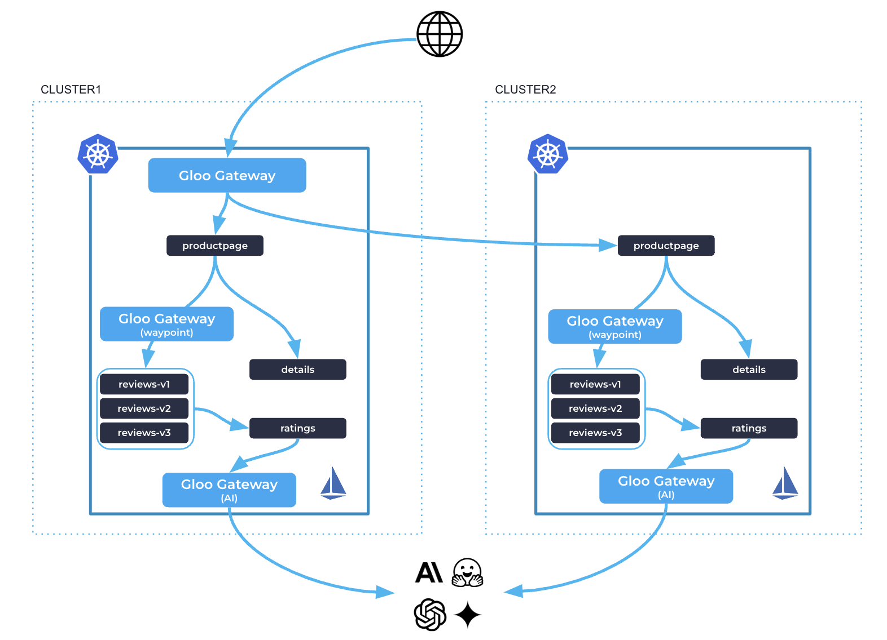

# Omni Part 2: Gloo Gateway as Ingress, Waypoint and Egress

Prereq: [Part 1: Gloo Ambient Multi-Cluster Mesh](https://github.com/rvennam/gloomesh-demo/blob/main/ambient/ambient-mc.md)

In this part, we will use Gloo Gateway as the Ingress, Waypoint and as an Egress AI Gateway.



## Install Gloo Gateway
```bash
export CLUSTER1=gke_ambient_one
export CLUSTER2=gke_ambient_two
export ISTIOCTL=/Users/ramvennam/Downloads/istioctl

helm repo add glooe https://storage.googleapis.com/gloo-ee-helm
helm repo update

helm upgrade --install -n gloo-system gloo glooe/gloo-ee \
--create-namespace \
--version 1.18.2 \
--kube-context $CLUSTER1
--set-string license_key=$GLOO_GATEWAY_LICENSE_KEY \
-f -<<EOF
gloo:
  discovery:
    enabled: false
  gatewayProxies:
    gatewayProxy:
      disabled: true
  kubeGateway:
    enabled: true
  gloo:
    disableLeaderElection: true
    deployment:
      customEnv:
        # The waypoint translator is disabled by default, so must explicitly enable it
        # TODO we can't edit gloo deploy env vars via the enterprise values...
        # That would make this much cleaner.
        - name: ENABLE_WAYPOINTS
          value: "true"
  settings:
    kubeResourceOverride:
      spec:
        # NOTE
        gloo: 
          removeUnusedFilters: true
gloo-fed:
  enabled: false
  glooFedApiserver:
    enable: false
grafana:
  defaultInstallationEnabled: false
observability:
  enabled: true
prometheus:
  enabled: false
ambient:
  # NOTE
  waypoint:
    enabled: true
EOF
```

```bash
kubectl --context ${CLUSTER1} label namespace gloo-system istio.io/dataplane-mode=ambient
kubectl --context ${CLUSTER1} set image Deployment/gloo -n gloo-system gloo=slandow/gloo-ee:ambient-multinet-fix-automtls
```

## Gloo Gateway as Ingress
```yaml
apiVersion: gateway.gloo.solo.io/v1alpha1
kind: GatewayParameters
metadata:
  name: gloo-gateway-override
  namespace: gloo-system
spec:
  kube:
    deployment:
      replicas: 1
    service:
      type: LoadBalancer
    envoyContainer:
      image:
        registry: slandow
        repository: gloo-ee-envoy-wrapper
        tag: proxy-tlv
---
kind: Gateway
apiVersion: gateway.networking.k8s.io/v1
metadata:
  name: http
  namespace: gloo-system
  annotations:
    gateway.gloo.solo.io/gateway-parameters-name: gloo-gateway-override
spec:
  gatewayClassName: gloo-gateway
  listeners:
  - protocol: HTTP
    port: 8080
    name: http
    allowedRoutes:
      namespaces:
        from: All
---
apiVersion: gateway.networking.k8s.io/v1
kind: HTTPRoute
metadata:
  name: bookinfo-gg
  namespace: bookinfo
spec:
  parentRefs:
  - name: http
    namespace: gloo-system
  rules:
  - matches:
    - path:
        type: Exact
        value: /productpage
    - path:
        type: PathPrefix
        value: /static
    - path:
        type: Exact
        value: /login
    - path:
        type: Exact
        value: /logout
    - path:
        type: PathPrefix
        value: /api/v1/products
    # backendRefs:
    # - name: productpage
    #   port: 9080
    backendRefs:
    - kind: Hostname
      group: networking.istio.io
      name: productpage.bookinfo.mesh.internal
      port: 9080
```
## Gloo Gateway as Waypoint

```yaml
apiVersion: gateway.gloo.solo.io/v1alpha1
kind: GatewayParameters
metadata:
  name: gloo-waypoint-override
  namespace: bookinfo
spec:
  kube:
    envoyContainer:
      image:
        registry: slandow
        repository: gloo-ee-envoy-wrapper
        tag: proxy-tlv
---
apiVersion: gateway.networking.k8s.io/v1
kind: Gateway
metadata:
 name: gloo-waypoint
 namespace: bookinfo
 annotations:
  gateway.gloo.solo.io/gateway-parameters-name: gloo-waypoint-override
spec:
 gatewayClassName: gloo-waypoint
 listeners:
 - name: proxy
   port: 15088
   protocol: istio.io/PROXY
```
```bash
kubectl --context ${CLUSTER1} label ns bookinfo istio.io/use-waypoint=gloo-waypoint  --overwrite
```

Use Gloo Gateway for header match traffic going to reviews
```yaml
apiVersion: gateway.networking.k8s.io/v1
kind: HTTPRoute
metadata:
  name: reviews
  namespace: bookinfo
spec:
  parentRefs:
  - group: ""
    kind: Service
    name: reviews
    port: 9080
  rules:
  - matches:
    - headers:
      - name: end-user
        value: jason
    backendRefs:
    - name: reviews-v2
      port: 9080
  - backendRefs:
    - name: reviews-v1
      port: 9080
```

## Gloo Gateway as an AI Gateway

```yaml
apiVersion: gateway.gloo.solo.io/v1alpha1
kind: GatewayParameters
metadata:
  name: gloo-ai-gateway-override
  namespace: gloo-system
spec:
  kube:
    aiExtension:
      enabled: true
    service:
      type: ClusterIP
---
kind: Gateway
apiVersion: gateway.networking.k8s.io/v1
metadata:
  name: ai-gateway
  namespace: gloo-system
  annotations:
    gateway.gloo.solo.io/gateway-parameters-name: gloo-ai-gateway-override
spec:
  gatewayClassName: gloo-gateway
  listeners:
  - protocol: HTTP
    port: 8080
    name: http
    allowedRoutes:
      namespaces:
        from: All
```


```bash
export OPENAI_API_KEY=<insert your API key>

kubectl --context ${CLUSTER1} create secret generic openai-secret -n gloo-system \
--from-literal="Authorization=Bearer $OPENAI_API_KEY" \
--dry-run=client -oyaml | kubectl apply -f -
```

```yaml
apiVersion: gloo.solo.io/v1
kind: Upstream
metadata:
  labels:
    app: gloo
  name: openai
  namespace: gloo-system
spec:
  ai:
    openai:
      authToken:
        secretRef:
          name: openai-secret
          namespace: gloo-system
---
apiVersion: gateway.networking.k8s.io/v1
kind: HTTPRoute
metadata:
  name: openai
  namespace: gloo-system
spec:
  parentRefs:
    - name: ai-gateway
      namespace: gloo-system
  rules:
  - matches:
    - path:
        type: PathPrefix
        value: /openai
    backendRefs:
    - name: openai
      namespace: gloo-system
      group: gloo.solo.io
      kind: Upstream
```

Call OpenAI from ratings:
```bash
kubectl --context ${CLUSTER1} exec -n bookinfo deploy/ratings-v1 -c ratings -- curl -v "gloo-proxy-ai-gateway.gloo-system:8080/openai" -H content-type:application/json -d '{"model": "gpt-4o-mini","max_tokens": 128,"messages": [{"role": "system","content": "You are a poetic assistant, skilled in explaining complex programming concepts with creative flair."},{"role": "user","content": "Compose a poem that explains the concept of recursion in programming."}]}' | jq
```

Check out the UI:

