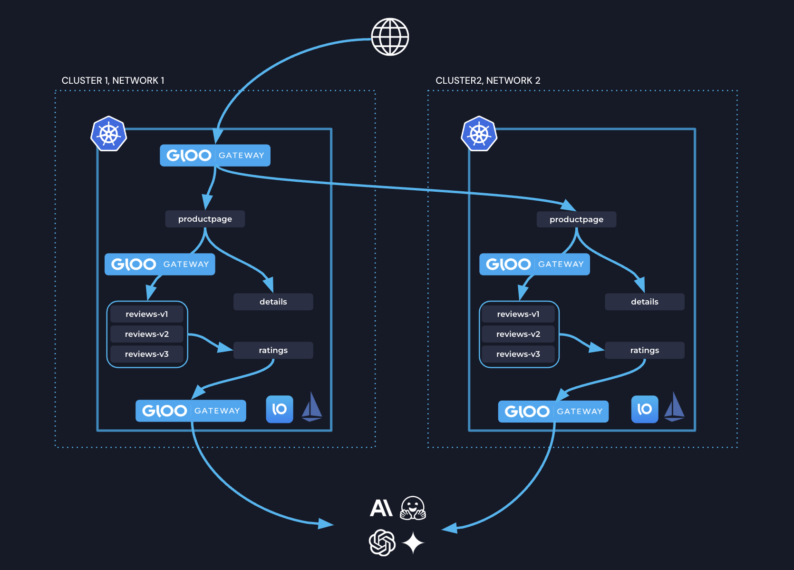
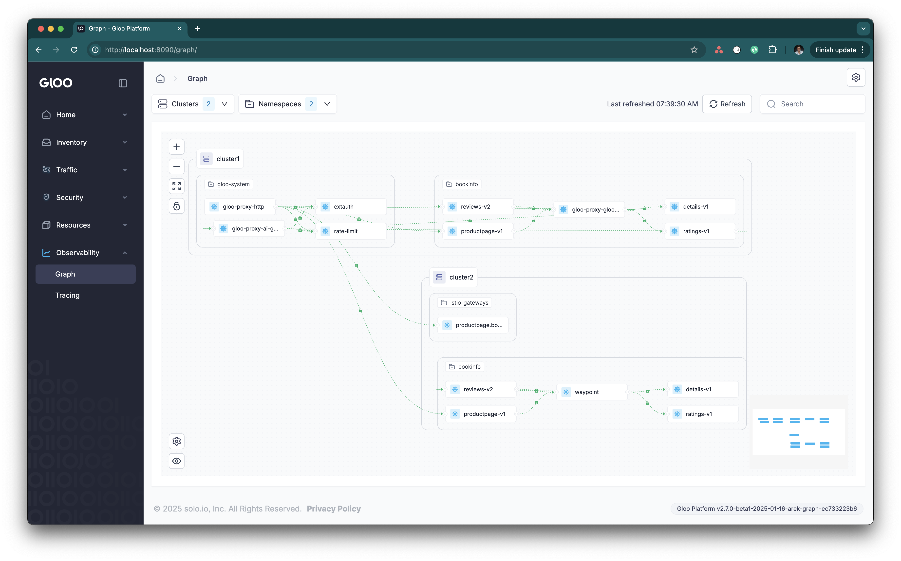

# Omni

Gloo: An omni-directional solution that covers ingress, service-to-service, and egress traffic with a unified approach.

### Env

1. Create two clusters
2. Download the latest solo istioctl nightly build

Set env vars
```bash
export CLUSTER1=gke_ambient_one
export CLUSTER2=gke_ambient_two
export ISTIOCTL=/Users/ramvennam/Downloads/istioctl
```

## Deploy Bookinfo sample

```bash
for context in ${CLUSTER1} ${CLUSTER2}; do
  kubectl --context ${context} create ns bookinfo 
  kubectl --context ${context} apply -n bookinfo -f https://raw.githubusercontent.com/istio/istio/release-1.24/samples/bookinfo/platform/kube/bookinfo.yaml
  kubectl --context ${context} apply -n bookinfo -f https://raw.githubusercontent.com/istio/istio/release-1.24/samples/bookinfo/platform/kube/bookinfo-versions.yaml
done
```

## Install Gloo Gateway on cluster1

```bash
helm repo add glooe https://storage.googleapis.com/gloo-ee-helm
helm repo update

helm upgrade --install -n gloo-system gloo glooe/gloo-ee \
--create-namespace \
--version 1.19.0-beta2 \
--kube-context ${CLUSTER1} \
--set-string license_key=$GLOO_GATEWAY_LICENSE_KEY \
-f ./gg-values.yaml
```

## Gloo Gateway to expose productpage

```yaml
kubectl --context=${CLUSTER1} apply -f - <<EOF
kind: Gateway
apiVersion: gateway.networking.k8s.io/v1
metadata:
  name: http
  namespace: gloo-system
spec:
  gatewayClassName: gloo-gateway
  listeners:
  - protocol: HTTP
    port: 80
    name: http
    allowedRoutes:
      namespaces:
        from: All
---
apiVersion: gateway.networking.k8s.io/v1
kind: HTTPRoute
metadata:
  name: bookinfo-gg
  namespace: bookinfo
spec:
  parentRefs:
  - name: http
    namespace: gloo-system
  rules:
  - matches:
    - path:
        type: Exact
        value: /productpage
    - path:
        type: PathPrefix
        value: /static
    - path:
        type: Exact
        value: /login
    - path:
        type: Exact
        value: /logout
    backendRefs:
    - name: productpage
      port: 9080
EOF
```

# Install Istio

## Configure Trust
```bash
function create_cacerts_secret() {
  context=${1:?context}
  cluster=${2:?cluster}
  kubectl --context=${context} create ns istio-system || true
  kubectl --context=${context} create ns istio-gateways || true
  kubectl --context=${context} create secret generic cacerts -n istio-system \
    --from-file=$HOME/istio-1.24.2/certs/${cluster}/ca-cert.pem \
    --from-file=$HOME/istio-1.24.2/certs/${cluster}/ca-key.pem \
    --from-file=$HOME/istio-1.24.2/certs/${cluster}/root-cert.pem \
    --from-file=$HOME/istio-1.24.2/certs/${cluster}/cert-chain.pem
}

create_cacerts_secret ${CLUSTER1} cluster1
create_cacerts_secret ${CLUSTER2} cluster2
```

## Install the Gloo Operator
```bash
for context in ${CLUSTER1} ${CLUSTER2}; do
  helm upgrade --install --kube-context=${context} gloo-operator oci://us-docker.pkg.dev/solo-public/gloo-operator-helm/gloo-operator --version 0.1.0-beta.3 -n gloo-system --create-namespace &
done
```


Use the `ServiceMeshController` resource to install Istio on both clusters

```bash
kubectl --context=${CLUSTER1} apply -f - <<EOF
apiVersion: operator.gloo.solo.io/v1
kind: ServiceMeshController
metadata:
  name: istio
spec:
  version: 1.24.3
  cluster: cluster1
  network: cluster1
EOF

kubectl --context=${CLUSTER2} apply -f - <<EOF
apiVersion: operator.gloo.solo.io/v1
kind: ServiceMeshController
metadata:
  name: istio
spec:
  version: 1.24.3
  cluster: cluster2
  network: cluster2
EOF
```


## Onboard Gloo Gateway and Bookinfo to the Mesh

```bash
kubectl --context ${CLUSTER1} label namespace gloo-system istio.io/dataplane-mode=ambient
kubectl --context ${CLUSTER1} label namespace bookinfo istio.io/dataplane-mode=ambient
kubectl --context ${CLUSTER2} label namespace bookinfo istio.io/dataplane-mode=ambient
```

### Peer the clusters together

Deploy an east-west gateway:
```bash
$ISTIOCTL --context=${CLUSTER1} multicluster expose -n istio-gateways
$ISTIOCTL --context=${CLUSTER2} multicluster expose -n istio-gateways
```

Link clusters together:
```bash
$ISTIOCTL multicluster link --contexts=$CLUSTER1,$CLUSTER2 -n istio-gateways
```

## Multi-Cluster Services

Enable productpage to be multi-cluster on both clusters
```bash
for context in ${CLUSTER1} ${CLUSTER2}; do
  kubectl --context ${context}  -n bookinfo label service productpage solo.io/service-scope=global
  kubectl --context ${context}  -n bookinfo annotate service productpage  networking.istio.io/traffic-distribution=Any
done
```


## Gloo Gateway Multi-Cluster Routing
Update the previously applied HTTPRoute to route to the global productpage destination:
```yaml
apiVersion: gateway.networking.k8s.io/v1
kind: HTTPRoute
metadata:
  name: bookinfo-gg
  namespace: bookinfo
spec:
  parentRefs:
  - name: http
    namespace: gloo-system
  rules:
  - matches:
    - path:
        type: Exact
        value: /productpage
    - path:
        type: PathPrefix
        value: /static
    - path:
        type: Exact
        value: /login
    - path:
        type: Exact
        value: /logout
    # backendRefs:
    # - name: productpage
    #   port: 9080
    backendRefs:
    - kind: Hostname
      group: networking.istio.io
      name: productpage.bookinfo.mesh.internal
      port: 9080
```

## Gloo Gateway as Waypoint

```yaml
apiVersion: gateway.networking.k8s.io/v1
kind: Gateway
metadata:
 name: gloo-waypoint
 namespace: bookinfo
spec:
 gatewayClassName: gloo-waypoint
 listeners:
 - name: proxy
   port: 15088
   protocol: istio.io/PROXY
```
```bash
kubectl --context ${CLUSTER1} label ns bookinfo istio.io/use-waypoint=gloo-waypoint  --overwrite
```

Use standard waypoint in cluster2
```bash
$ISTIOCTL --context=${CLUSTER2} waypoint apply -n bookinfo
kubectl --context ${CLUSTER2} label ns bookinfo istio.io/use-waypoint=waypoint  --overwrite
```

Use waypoints for canary traffic going to reviews
```yaml
apiVersion: gateway.networking.k8s.io/v1
kind: HTTPRoute
metadata:
  name: reviews
  namespace: bookinfo
spec:
  parentRefs:
  - group: ""
    kind: Service
    name: reviews
    port: 9080
  rules:
  - matches:
    - headers:
      - name: end-user
        value: jason
    backendRefs:
    - name: reviews-v2
      port: 9080
  - backendRefs:
    - name: reviews-v1
      port: 9080
```
Apply the above yaml to both clusters:
```bash
kubectl apply -f reviews-L7.yaml --context $CLUSTER1
kubectl apply -f reviews-L7.yaml --context $CLUSTER2
```

## Gloo Gateway as an AI Gateway

```yaml
apiVersion: gateway.gloo.solo.io/v1alpha1
kind: GatewayParameters
metadata:
  name: gloo-ai-gateway-override
  namespace: gloo-system
spec:
  kube:
    aiExtension:
      enabled: true
    service:
      type: ClusterIP
    envoyContainer:
      image:
        registry: quay.io/solo-io
        repository: gloo-ee-envoy-wrapper
        tag: 1.18.2
---
kind: Gateway
apiVersion: gateway.networking.k8s.io/v1
metadata:
  name: ai-gateway
  namespace: gloo-system
  annotations:
    gateway.gloo.solo.io/gateway-parameters-name: gloo-ai-gateway-override
spec:
  gatewayClassName: gloo-gateway
  listeners:
  - protocol: HTTP
    port: 8080
    name: http
    allowedRoutes:
      namespaces:
        from: All
```

```bash
kubectl --context ${CLUSTER1} create secret generic openai-secret -n gloo-system \
--from-literal="Authorization=Bearer $OPENAI_API_KEY" \
--dry-run=client -oyaml | kubectl apply -f -
```

```yaml
apiVersion: gloo.solo.io/v1
kind: Upstream
metadata:
  labels:
    app: gloo
  name: openai
  namespace: gloo-system
spec:
  ai:
    openai:
      authToken:
        secretRef:
          name: openai-secret
          namespace: gloo-system
---
apiVersion: gateway.networking.k8s.io/v1
kind: HTTPRoute
metadata:
  name: openai
  namespace: gloo-system
spec:
  parentRefs:
    - name: ai-gateway
      namespace: gloo-system
  rules:
  - matches:
    - path:
        type: PathPrefix
        value: /openai
    backendRefs:
    - name: openai
      namespace: gloo-system
      group: gloo.solo.io
      kind: Upstream
```

Call OpenAI from ratings:
```bash
kubectl --context ${CLUSTER1} exec -n bookinfo deploy/ratings-v1 -c ratings -- curl -v "gloo-proxy-ai-gateway.gloo-system:8080/openai" -H content-type:application/json -d '{"model": "gpt-4o-mini","max_tokens": 128,"messages": [{"role": "system","content": "What is an Omni Gateway?"}]}' | jq
```

## Gloo Management Plane

### cluster1 will be both workload and managment:
```bash

helm upgrade -i gloo-platform-crds gloo-platform/gloo-platform-crds -n gloo-mesh --create-namespace --version=2.7.0-rc2
helm upgrade -i gloo-platform gloo-platform/gloo-platform -n gloo-mesh --version 2.7.0-rc2 --values mgmt-values.yaml \
  --set licensing.glooMeshLicenseKey=$GLOO_MESH_LICENSE_KEY
```

### Register cluster2 as a workload cluster to cluster1:
```bash
export TELEMETRY_GATEWAY_ADDRESS=$(kubectl get svc -n gloo-mesh gloo-telemetry-gateway --context $CLUSTER1 -o jsonpath="{.status.loadBalancer.ingress[0]['hostname','ip']}"):4317

meshctl cluster register cluster2  --kubecontext $CLUSTER1 --profiles gloo-core-agent --remote-context $CLUSTER2 --telemetry-server-address $TELEMETRY_GATEWAY_ADDRESS
```

